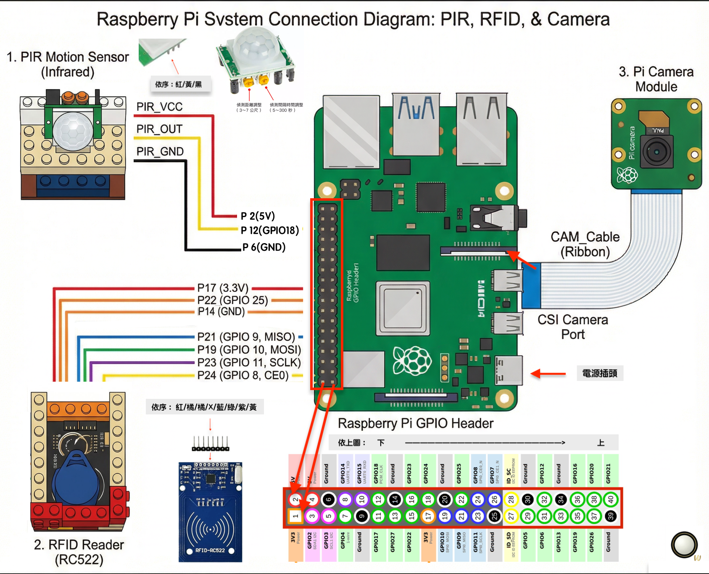
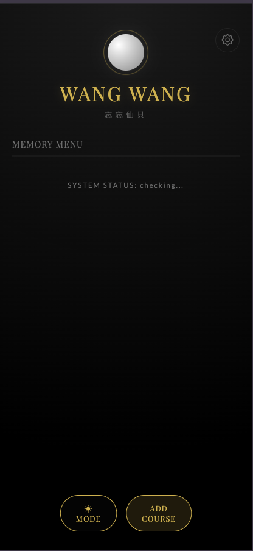
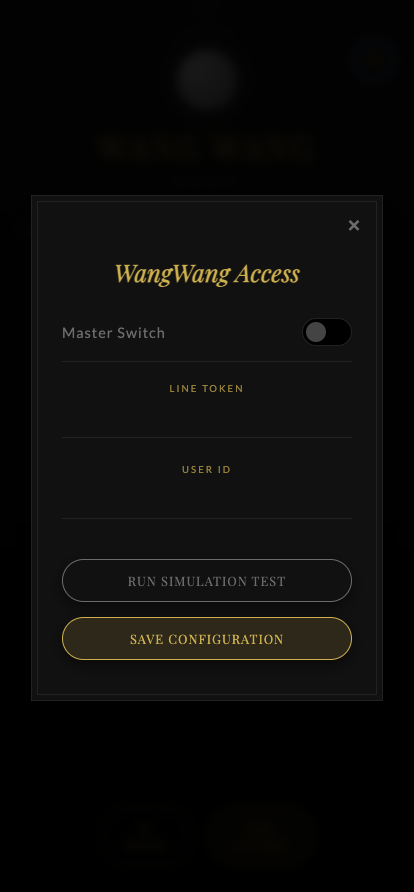
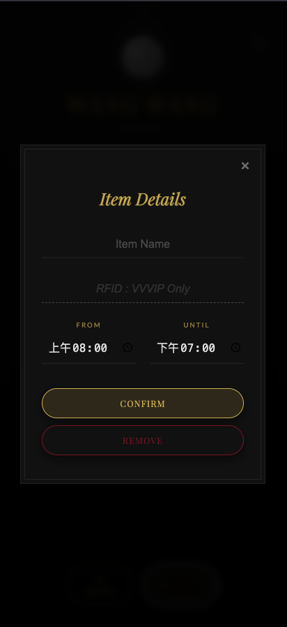
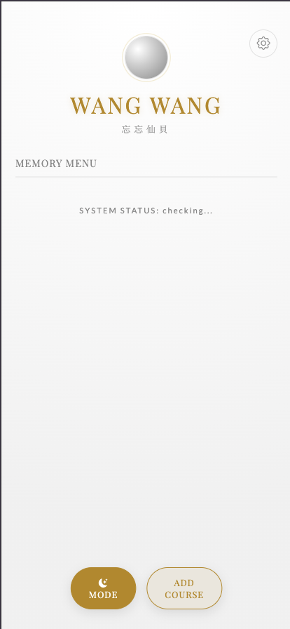

# WANG WANG | 忘忘仙貝

「在遺忘的深淵裡，燃起希望的貝殼。」


## 專案簡介

WANG WANG (忘忘仙貝) 是一個結合 IoT 技術的智慧出門提醒系統。

本專案運行於 Raspberry Pi 4，透過多重感測器邏輯，優雅地解決現代人出門口令手機、鑰匙、錢包、煙...等等，將「被提醒」這件事，轉化為一種從容的體驗。系統隱身於背景運作，僅在您確實遺漏物品時，透過優雅的介面與 LINE 推播進行通知。

讓忠孝東路不再走九遍，讓因為遺忘而返家機會大幅下降。

## 專案結構

```
wang_wang_project/
├── main.py # [後端核心] 整合 Flask Server 與 感測器邏輯執行緒
├── data.json # [資料庫] 儲存物品清單、LINE Token、開關設定
├── requirements.txt # [依賴清單] Python 套件列表
├── templates/
│ └── index.html # [前端介面] 無光晚餐風格 Web App (HTML/CSS/JS)
└── src/
└── 圖片.png # [資源] 專案海報圖片
```

### 核心運作流程

1. 喚醒 (Wake Up)：利用 PIR 紅外線感測器 偵測門口是否有人員經過。

2. 確認 (Verify)：啟動 攝影機 進行動態影像分析 (Motion Detection)，確認是否為有效的出門動作。

3. 盤點 (Check)：檢視後端資料是否有開啟物品偵測，若有啟動 RFID 讀卡機 掃描玄關置物區。若無則恢復待機。

4. 邏輯：若掃描到標籤 ID → 代表物品還在感測區內（未帶走）→ 判定為遺漏。

5. 邏輯：若掃描不到標籤 ID → 代表物品已離開感測區 → 判定為已帶走。

6. 通知 (Notify)：若判定有遺漏，透過 LINE Messaging API 發送推播通知至使用者手機。

## 系統架構與接線圖



1. 硬體接線示意圖本專案採用特殊的腳位配置以避免 PIR 與 RFID 的電源衝突，請務必依照圖表連接。

   %% 連接線：PIR（紅外線感測器 PIR）
   P2 --- PIR_VCC
   P6 --- PIR_OUT
   P12 --- PIR_GND

   %% 連接線：RFID (避開衝突，使用第二組電源腳位)
   P17 --- RC_33V
   P22 --- RC_RST
   P14 --- RC_GND
   P21 --- RC_MISO
   P19 --- RC_MOSI
   P23 --- RC_SCK
   P24 --- RC_SDA

   %% 連接線：相機
   CSI_PORT === CAM_Cable

# 接線重要提示：PIR：使用 Pin 1 (3.3V) 與 Pin 6 (GND)。RFID：改用 Pin 17 (3.3V) 與 Pin 14 (GND) 以避開衝突，訊號線接在 SPI0 對應腳位。

1. Camera：使用軟排線連接板上的 CSI 介面，藍色面朝向 USB 孔。
2. 硬體需求 (Hardware Requirements)核心控制器: Raspberry Pi 4 Model B (建議 4GB+)
3. 人員偵測: PIR Motion Sensor (HC-SR501)
4. 物品感測: RFID-RC522 模組 (SPI 介面) + Tag 影像捕捉: Raspberry Pi Camera Module (CSI 介面)
5. 網路連線: Wi-Fi 或 Ethernet 軟體環境與依賴 (Software Setup)系統設定請在 Raspberry Pi 上執行 sudo raspi-config 並啟用以下介面：Camera Interface (Legacy 或 Libcamera)SPI Interface (用於 RFID 讀取)
6. Python 套件安裝本專案使用 Python 3 開發，請執行以下指令安裝依賴：# 更新系統
   sudo apt-get update && sudo apt-get upgrade -y

# 安裝基礎套件與 GPIO 庫

sudo apt-get install python3-pip python3-dev python3-rpi.gpio libgl1-mesa-glx -y

## 啟動環境

1. 建議使用現有虛擬環境 `.venv`。

2. 安裝依賴（如尚未安裝）(註：requirements.txt 內容包含 flask, requests, opencv-python-headless, spidev, mfrc522, pyserial)

```bash

pip install -r requirements.txt

```

3. 執行主程式啟動 Flask 伺服器：

```bash

# 預設 5000

python main.py


# 或指定其他埠避免衝突

PORT=5001 python main.py

```

瀏覽：

- 本機: http://127.0.0.1:5000 (或指定埠)

- 區網: http://<你的局域網 IP>:5000

## 軟體功能特色

1. 風格介面：採用極致黑 (#050505) 與香檳金 (#D4AF37) 配色與襯線字體，提供奢華的操作體驗。VVVIP 跳窗機制：針對非付費會員限制物品數量。
2. 雙重感測確認：結合 PIR (初步喚醒) 與 Camera (動態確認)，降低誤報率。
3. 反向偵測邏輯：利用 RFID 偵測物品「是否存在」於玄關，而非偵測物品是否離開，確保邏輯準確。
4. LINE 智慧通知：透過 Messaging API 發送推播，精準告知使用者遺漏了哪一項物品。
5. Web 遠端控制：手機瀏覽器即可設定監控時段、新增物品、綁定 Tag ID。

## UI 展示

### 主頁



### 會員設定



### 加東西



### 暗黑模式



```
快速開始(Quick Start)確認接線：請依照上方接線圖確認硬體無誤。
啟動系統：python3 main.py
連線介面：開啟手機瀏覽器，輸入樹莓派 IP (例如 http://192.168.1.100:5000)。
初始化設定：在網頁設定頁面填入 LINE Channel Access Token 與 User ID。
新增物品並輸入對應的 RFID Tag ID。
開始運作：系統即開始背景運作，等待出門事件觸發。
```

## 參考資料 (References)

1. [Raspberry Pi GPIO](https://pinout.xyz/)
2. [Pinoutpi-rc522](https://github.com/ondryaso/pi-rc522)
3. [LibraryLINE Messaging API Documentation](https://developers.line.biz/en/docs/messaging-api/)

# 敬請期待


