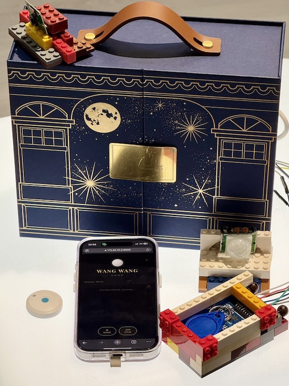
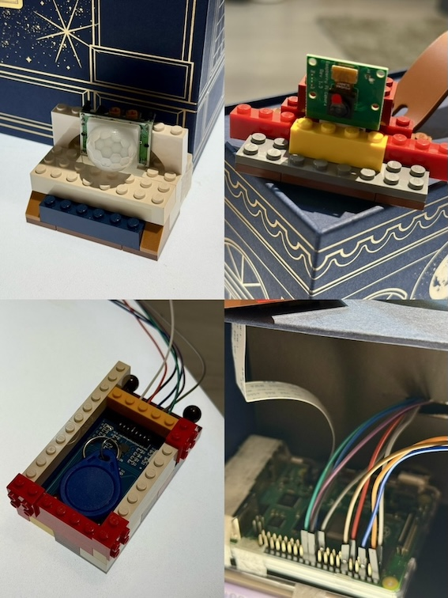
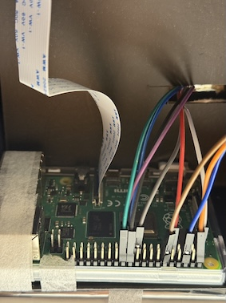
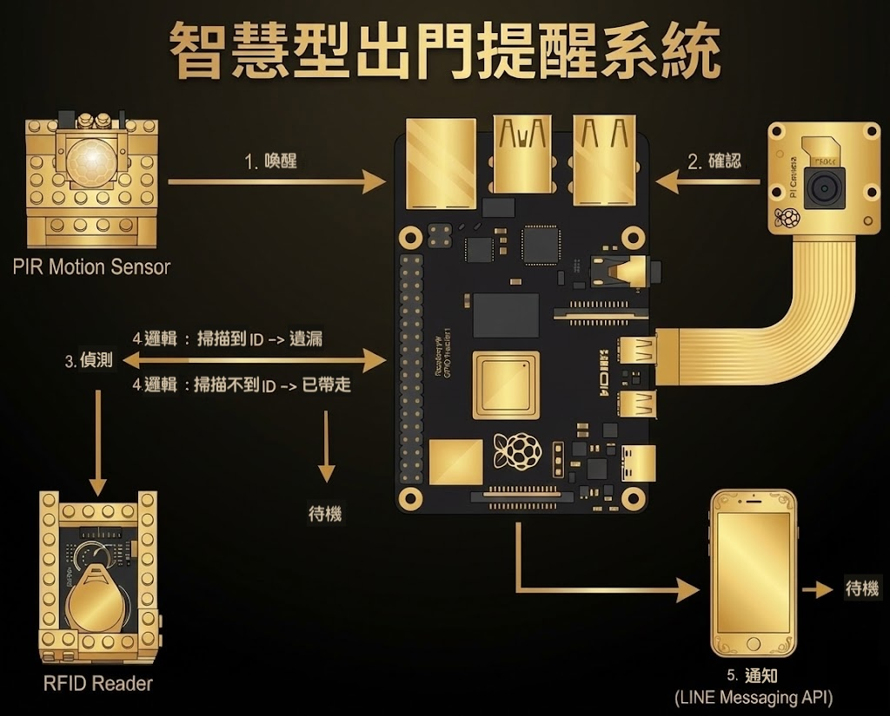

# WANG WANG | 忘忘仙貝

「在遺忘的深淵裡，燃起希望的貝殼。」


## 專案簡介

WANG WANG (忘忘仙貝) 是一個結合 IoT 技術的智慧出門提醒系統。

```
本來應該從從容容，游刃有餘。
現在是匆匆忙忙，忘東忘西。
```

本專案運行於 Raspberry Pi 4，透過多重感測器邏輯，優雅地解決現代人出門口令手機、鑰匙、錢包、煙...等等，將「被提醒」這件事，轉化為一種從容的體驗。系統隱身於背景運作，僅在您確實遺漏物品時，透過優雅的介面與 LINE 推播進行通知。

讓使用者在忙碌的生活中，再次回到從從容容，游刃有餘！





## 專案結構

```
wang_wang_project/
├── main.py # [後端核心] 整合 Flask Server 與 感測器邏輯執行緒
├── data.json # [資料庫] 儲存物品清單、LINE Token、開關設定
├── requirements.txt # [依賴清單] Python 套件列表
├── templates/
│ └── index.html # [前端介面]  Web App (HTML/CSS/JS)
└── src/
└── 圖片.png # [資源] 專案海報圖片
```

### 核心運作流程



1. 初始化與歸零 (PIR Reset)
   這是為了防止上一次的動作殘留導致無限觸發。
   邏輯：檢查 PIR 腳位狀態，若為 High (1)，則強制等待直到訊號變回 Low (0)。
   檢查頻率：1 秒 (每次迴圈 time.sleep(1))
   條件：必須等到 PIR=0 才會進入下一步。

2. 喚醒 ：利用 PIR 紅外線感測器 偵測門口是否有人員經過。
   等待有人經過門口。
   邏輯：PIR 感測器偵測紅外線變化。
   檢查頻率：0.2 秒 (每次迴圈 time.sleep(0.2))
   觸發條件：GPIO 讀值為 1。

3. 確認 ：啟動 攝影機 進行動態影像分析 (Motion Detection)，確認是否為有效的出門動作。
   透過影像辨識確認這不是誤判，而是真的有人要出門。
   暖機時間：15 幀 (變數 MOTION_WARMUP_FRAMES)
   目的：讓鏡頭光圈與白平衡穩定，建立背景模型。
   偵測總時長：5 秒 (變數 timeout_seconds)
   若 5 秒內沒偵測到足夠動作，視為沒出門，返回待機。
   移動判定門檻：15,000 像素 (變數 MOTION_THRESHOLD)
   畫面中間 1/3 區域變動像素超過此數值才算移動。
   連續觸發幀數：3 幀 (變數 MOTION_CONSECUTIVE_FRAMES)
   必須連續 3 張畫面都判定有移動，才算有效出門 (防止閃爍誤判)。

4. 偵測 ：檢視後端資料是否有開啟物品偵測，若有啟動 RFID 讀卡機 掃描玄關置物區。若無則恢復待機。
   根據 data.json 設定，對有效時段內的物品進行檢查。

```
A. RFID 模式 (無 MAC 位址)
適用於鑰匙、錢包等被動式物品至於掃描盤上
邏輯：檢查「物品是否還在感測區」
掃描次數：10 次 (變數 check_times)
掃描間隔：0.1 秒
判定標準：
- Y 邏輯 ：10 次中有 任一次 讀到 ID → 判定為 遺漏 (Forgotten)。
- N 邏輯 ：10 次都沒讀到 → 判定為 已帶走 (Taken)。

B. 藍牙 BLE 模式 (有 MAC 位址)
適用於手機、智慧手錶等主動發訊設備
邏輯：蒐集訊號強度 (RSSI) 並分析穩定度
掃描時長：10 秒 (變數 SCAN_DURATION)
判定標準 (RSSI 差值)：
- Y 邏輯 ：(最後一筆訊號 - 第一筆訊號) 的絕對值 <= 5 → 訊號穩定 (沒移動) → 判定為 遺漏 (Forgotten)。
- N 邏輯 ：差值 > 5 或 數據不足 → 訊號變動 (正在移動) → 判定為 已帶走 (Taken)。

```

5. 通知與冷卻 (Notification & Cooldown)
   流程結束後的處理。
   LINE 通知節流：15 秒 (變數 MIN_NOTIFY_INTERVAL_SECONDS)
   避免短時間內連續發送兩次通知。

6. 待機 : reset 系統強制冷卻 5 秒流程結束後強制休息，讓使用者有時間離開感測區，避免 PIR 再次觸發 -> PIR 紅外線感測器

## 接線圖


硬體接線示意圖本專案採用特殊的腳位配置以避免 PIR 與 RFID 的電源衝突，請務必依照圖表連接。

```
   - 連接線：PIR（紅外線感測器 PIR）
     P2 --- PIR_VCC
     P6 --- PIR_OUT
     P12 --- PIR_GND

   - 連接線：RFID (避開衝突，使用第二組電源腳位)
     P17 --- RC_33V
     P22 --- RC_RST
     P14 --- RC_GND
     P21 --- RC_MISO
     P19 --- RC_MOSI
     P23 --- RC_SCK
     P24 --- RC_SDA

   - 連接線：相機
     CSI_PORT === CAM_Cable
```

### 詳細介接內容

1. Camera：使用軟排線連接板上的 CSI 介面，藍色面朝向 USB 孔。

2. 硬體需求 (Hardware Requirements)：

- 核心控制器: Raspberry Pi 4 Model B (建議 4GB+)

- 人員偵測: PIR Motion Sensor (HC-SR501)

- 物品感測 1: RFID-RC522 模組 (SPI 介面) + Tag

- 物品感測 2: 內建藍牙晶片 (用於偵測手機/手錶)

- 影像捕捉: Raspberry Pi Camera Module (CSI 介面)

3. 軟體環境：

- 需啟用 Camera Interface (Legacy 或 Libcamera)

- 需啟用 SPI Interface (用於 RFID)

- 需啟用 Bluetooth 介面

## 安裝基礎套件與 GPIO 庫

### Python 套件安裝本專案使用 Python 3 開發，請執行以下指令安裝依賴：

```
sudo apt-get install python3-pip python3-dev python3-rpi.gpio libgl1-mesa-glx -y
```

### 系統更新

```
sudo apt-get update && sudo apt-get upgrade -y
```

### 啟動環境

1. 建議使用現有虛擬環境 `.venv`。

2. 安裝套件已寫在 requirements.txt（如尚未安裝）內容包含 flask, requests, opencv-python-headless, spidev, mfrc522, pyserial, bleak, asyncio）

```bash

pip install -r requirements.txt

```

3. 執行主程式啟動 Flask 伺服器：

```bash

### 預設 5000

python main.py


### 若有衝突可指定其他port

PORT=5001 python main.py

```

### 瀏覽：

- 本機: http://127.0.0.1:5000 (或指定埠)

- 區網: http://<你的局域網 IP>:5000

### json 目前只能 1 個 item

```
{
"system_enabled": true,
"line_token": "YOUR_LINE_TOKEN",
"line_user_id": "YOUR_USER_ID",
"items": [
{
"name": "鑰匙",
"start_time": "08:00",
"end_time": "09:00",
"enabled": true,
"mac": "" || "XX:XX:XX:XX:XX:XX",
}
]
}

```

### 可調變數

| 變數名稱                  | 目前數值 | 說明             | 調整建議                                       |
| ------------------------- | -------- | ---------------- | ---------------------------------------------- |
| SCAN_DURATION             | 10 (秒)  | 藍牙掃描時間     | 若希望能更快判定，可降至 5~8，但準確度可能下降 |
| MOTION_THRESHOLD          | 15000    | 鏡頭移動像素門檻 | 若太容易誤觸發(貓狗經過)，可調高至 20000       |
| MOTION_CONSECUTIVE_FRAMES | 3 (幀)   | 連續移動判定     | 連續移動判定,若動作快抓不到，可降至 1 或 2     |
| check_times               | 10 (次)  | RFID 重試次數    | 若感應不靈敏，可調高至 20                      |

## 軟體功能/UIUX

1. 無光晚餐風格介面 (Dining in the Dark UI)

- Web 遠端控制：手機瀏覽器即可設定監控時段、新增物品、綁定 Tag ID。

- 黑金美學：採用極致黑 (#050505) 與香檳金 (#D4AF37) 配色，打造奢華的操作體驗。

- 模式切換：支援一鍵切換依照心情切換自己喜歡的模式(暗黑模式)。

- 呼吸燈 Logo：首頁貝殼 Logo 具備呼吸燈效果，象徵系統正在運作。

2. VVVIP 尊爵互動機制

- 額度限制：免費版使用者僅能新增 1 個 記憶物品。

- 跳窗：若嘗試新增第 2 個物品，系統將彈出 「VVVIP 尊爵禮遇」 提示，幽默地建議使用者升級（或刪除舊項目）。

- 唯讀保護：RFID MAC 欄位預設鎖定並顯示 VVVIP Only，增加高級感與安全性。

3. 智慧感測與通知

- 雙重確認：結合 PIR + Camera，有效降低誤報率。
- 混合偵測技術：
- 反向偵測邏輯的利用 RFID 偵測物品「是否存在」於玄關，而非偵測物品是否離開，確保邏輯準確。
- BLE 動態分析：分析藍牙訊號強度變化，判斷物品是否靜止（遺忘）或隨人移動（帶走）
- LINE 推播：透過 Messaging API 發送推播，精準告知「遺漏了什麼物品」，而非籠統的警報聲。

### 主頁


### 會員設定


### 加東西


### 暗黑模式


## 快速開始 (Quick Start)

```
1. 確認接線：請依照上方接線圖確認硬體無誤。

2. 啟動系統：
python3 main.py

3. 連線介面：
開啟手機瀏覽器，輸入樹莓派 IP (例如 http://192.168.1.100:5000)。

4. 初始化設定：

點擊 Settings，填入 LINE Channel Access Token 與 User ID。

點擊 Save Configuration。

新增物品：

點擊 Add Course，輸入物品名稱與監控時段。

(注意：免費版僅限新增 1 個物品，新增第 2 個會觸發 VVVIP 提示)

5. 開始運作：系統即開始背景運作，等待出門事件觸發。
```

## 參考資料 (References)

1. [Raspberry Pi GPIO](https://pinout.xyz/)
2. [Pinoutpi-rc522](https://github.com/ondryaso/pi-rc522)
3. [LibraryLINE Messaging API Documentation](https://developers.line.biz/en/docs/messaging-api/)
4. [RaspberryPi 使用 RFID-RC522 讀取與寫入磁卡與磁扣](https://sites.google.com/view/zsgititit/home/%E7%A1%AC%E9%AB%94%E5%AF%A6%E4%BD%9C/raspberry-shu-mei-pai/raspberrypi%E4%BD%BF%E7%94%A8rfid-rc522%E8%AE%80%E5%8F%96%E8%88%87%E5%AF%AB%E5%85%A5%E7%A3%81%E5%8D%A1%E8%88%87%E7%A3%81%E6%89%A3)

# 敬請期待 熱烈募資中!!!


